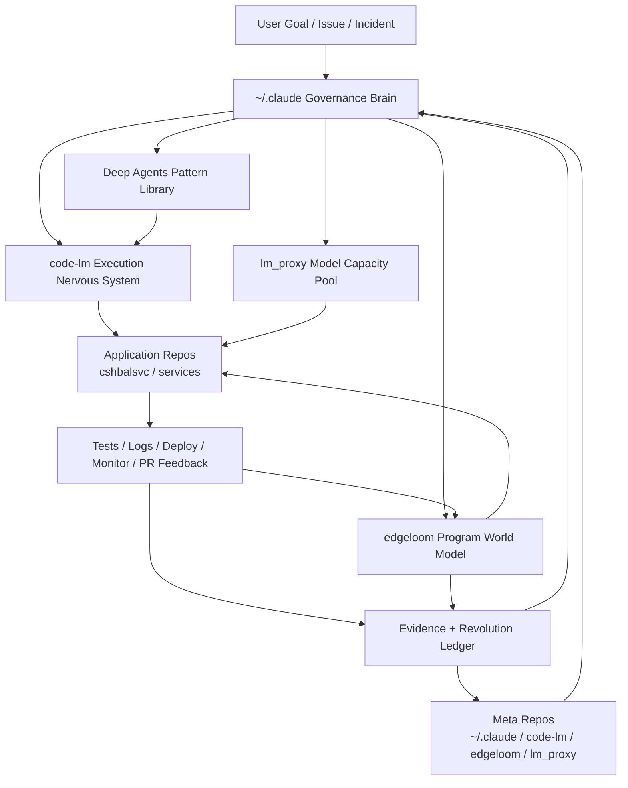

# AI Driven Self-Revolution System — Discussion Summary

> Date: 2026-05-31  
> Status: discussion synthesis / architecture notes, not an implementation commitment.  
> Scope: summary of the full discussion about LangChain Deep Agents, `~/.claude`, `code-lm`, `lm_proxy`, `edgeloom` / `code-graph`, and an AI-driven self-improving engineering system across both application repos and AI-supporting repos.

## 1. Core Thesis

The target is not simply “AI writes code faster.” The target is an **AI Driven Self-Revolution System**:

> A recursive engineering ecosystem that improves software products and also improves the AI tooling, workflows, prompts, graph intelligence, review loops, and execution substrate that make future improvements better.

This creates two coupled improvement loops:

1. **Application Revolution Loop** — improve business/software repos such as `cshbalsvc`.
2. **Meta Revolution Loop** — improve the AI-development system itself: `~/.claude/`, `~/myDev/code-lm/`, `~/myDev/code-graph/`, `~/myDev/lm_proxy/`, Deep Agents adapters, skills, rules, evidence ledgers, and replay/eval harnesses.

The important distinction:

- Normal automation: AI helps finish a task.
- Self-revolution: every task also produces evidence about how the AI system should improve next.

## 2. System Mental Model



The system is best understood as an organism:

| Component | Role | Function |
|---|---|---|
| `~/.claude/` | Governance Brain | Skills, rules, agents, workflows, convergence protocols, safety policy |
| `~/myDev/code-lm/` | Execution Nervous System | VS Code Copilot runtime, multi-session/multi-model agent control, prompt dispatch |
| `~/myDev/code-graph/` / `edgeloom` | Program World Model | AST/CFG/DFG/BRG/source/runtime graph facts, evidence and impact analysis |
| `~/myDev/lm_proxy/` | Model Capacity Pool | Claude/GPT/Opus slot pool and extra execution capacity |
| `~/myDev/deepagents/` | Agent Harness Pattern Library | Stateful agents, filesystem discipline, subagents, memory, rubrics, middleware patterns |
| Business repos such as `cshbalsvc` | Target Organisms | Code, tests, performance, deployment, monitoring, business behavior |
| Logs/tests/deployment/monitoring | Sensory System | Runtime truth, regressions, failures, performance drift, production feedback |

## 3. Key Architectural Decision

Deep Agents should **not** replace the existing `code-lm` + `~/.claude` workflow.

The better integration is:

```text
~/.claude skill / rule / agent
  -> invoked directly by code-lm
  -> prompt-injects Deep Agents-style operating patterns
  -> uses edgeloom for graph evidence
  -> writes file-based artifacts / ledgers
  -> feeds future workflow improvements
```

Reason:

- The current `~/.claude` system is already directly consumed by `code-lm`.
- `code-lm` is the active runtime/control plane for VS Code Copilot sessions.
- Deep Agents provides useful patterns, but does not need to become the only execution runtime.
- `edgeloom` provides deterministic program facts that both `code-lm` and Deep Agents-style agents should consume.

Recommended role split:

| Layer | Owner |
|---|---|
| Workflow protocol | `~/.claude` |
| Live agent sessions | `code-lm` |
| Extra model slots | `lm_proxy` |
| Program evidence | `edgeloom` |
| Agent orchestration patterns | Deep Agents |
| Business changes | target repos such as `cshbalsvc` |

## 4. Deep Agents Findings

The discussion inspected `~/myDev/deepagents/` as the authoritative source.

Important observations:

- Deep Agents SDK is a LangChain/LangGraph-based agent harness.
- It supports filesystem tools, skills, memory, subagents, async subagents, context management, middleware, and rubrics.
- `deepagents-code` is the coding-agent surface.
- `deepagents-cli` has evolved toward deployment tooling rather than being the main coding agent.
- Deep Agents Code has experimental support for `~/.claude/skills` and project `.claude/skills`.
- It does not directly consume all of `~/.claude/agents`, `~/.claude/rules`, or `~/.claude/settings.json` without adapters.

Useful Deep Agents concepts for this system:

| Deep Agents Concept | How to reuse it |
|---|---|
| Stateful graph execution | Long-running workflow / goal runner |
| Filesystem backend | File-backed evidence and artifacts |
| Skills | Reuse `~/.claude/skills` where compatible |
| Subagents | Reviewer, breaker, implementer, architect roles |
| RubricMiddleware | Convergence and quality gates |
| Summarization/context management | Compact long task history and graph context |
| Code interpreter / tools | Structured analysis tasks |
| MCP/tool adapters | Expose external systems and `edgeloom` queries |

Recommended stance:

> Treat Deep Agents as a pattern and harness library that can be injected into `code-lm` sessions or wrapped around background tasks, not as a forced replacement for the current stack.

## 5. Deep Agents Evolution and Trend

From the local git history and changelogs:

- The repo evolved quickly from SDK/examples into a broader platform.
- Coding-agent functionality moved into `deepagents-code`.
- `deepagents-cli` became more focused on `init`, `dev`, and `deploy`.
- SDK releases added state schema, rubric middleware, code interpreter middleware, filesystem permissions, harness profiles, and other infrastructure.

Trend inference:

1. Deep Agents is becoming a general agent harness, not just a single coding assistant.
2. The coding surface is splitting from deployment and SDK surfaces.
3. More emphasis is likely to go toward reusable middleware, long-running agent state, tool integration, deployable agents, safety/permissions, and evaluation/rubric loops.

For this project, the best leverage is to extract patterns and adapter surfaces rather than migrating everything wholesale.

## 6. Existing Stack Roles

### 6.1 `~/.claude` — Governance Brain

`~/.claude` contains the operational workflow system:

- Skills
- Rules
- Agents
- Settings
- Hooks
- Session conventions
- Spec/plan/exec/review/merge protocols
- Convergence and reviewer rules
- Safety and exception-handling conventions

Important clarification from the user:

> All files in `~/.claude` are directly invoked by `code-lm`.

Therefore, `~/.claude` is not just documentation. It is an active **control plane**.

### 6.2 `~/myDev/code-lm` — Execution Nervous System

`code-lm` is the VS Code Copilot runtime/control plane:

- Creates and controls named Copilot Chat sessions.
- Routes prompts to multiple models/sessions.
- Manages mode/model/permission state.
- Supports reviewer, discussion peer, implementer, and convergence roles.
- Bridges `~/.claude` skills into live AI execution.

In the self-revolution architecture:

```text
~/.claude says what should happen.
code-lm decides which live agent session does it.
edgeloom provides evidence.
Deep Agents patterns shape the agent behavior.
```

### 6.3 `~/myDev/lm_proxy` — Model Capacity Pool

`lm_proxy` provides additional model execution capacity through a slot-pool model.

Potential uses:

- Secondary reviewers.
- Heavy evaluation jobs.
- Replay/eval sessions.
- Cross-model adversarial review.
- Background proposal generation.

### 6.4 `~/myDev/code-graph` / `edgeloom` — Program World Model

`code-graph` has been renamed to `edgeloom`.

It provides:

- Graphify-backed AST graph ingestion.
- Call graph query.
- CFG / DFG / interprocedural layers.
- BRG / business rule graph work.
- SQL AST / SQL DFG / SQL BRG.
- Cross-language facts.
- Runtime sidecar.
- Reconcile observed runtime calls against static graph.
- Context packs.
- Impact analysis.
- Visualization/publish.
- Findings import.

Critical conclusion:

> `edgeloom` should become the **Program World Model** and evidence substrate for AI coding.

Without `edgeloom`, agents mostly reason from text and grep. With `edgeloom`, agents can reason from structured program facts.

## 7. Immediate `edgeloom` Integration Finding

There is a current naming/path mismatch in `~/.claude/skills`:

- `~/.claude/skills/code-graph-enhance/SKILL.md`
- `~/.claude/skills/code-graph-query/SKILL.md`

These symlinks point to old locations under:

- `~/myDev/code-graph/skills/code-graph-enhance/SKILL.md`
- `~/myDev/code-graph/skills/code-graph-query/SKILL.md`

But the actual repo now has:

- `~/myDev/code-graph/skills/edgeloom-enhance/SKILL.md`
- `~/myDev/code-graph/skills/edgeloom-query/SKILL.md`

This matters because `~/.claude` files are directly invoked by `code-lm`.

Recommended first integration fix:

- Add or repair `~/.claude/skills/edgeloom-enhance` and `~/.claude/skills/edgeloom-query`.
- Optionally keep legacy `code-graph-*` aliases for compatibility.
- Prefer new naming in future workflows.

## 8. Application Revolution Loop

This loop improves business repos such as `cshbalsvc`.

```text
Observe
  -> Understand
  -> Propose
  -> Spec
  -> Plan
  -> Implement
  -> Test
  -> Deploy
  -> Monitor
  -> Learn
```

| Stage | Goal | Evidence |
|---|---|---|
| Observe | Collect failures, logs, tickets, test output, PR comments | logs, DRQS/Jira, CI, review comments |
| Understand | Build graph-grounded understanding | `edgeloom search/impact/context-pack` |
| Propose | Identify high-leverage improvement | graph risk, runtime anomalies, test gaps |
| Spec | Define measurable behavior change | graph paths, assumptions, excluded paths |
| Plan | Break work into atomic tasks | graph slices, affected modules/tests |
| Implement | Make small controlled edits | code-lm implementer sessions |
| Test | Run selected and regression tests | graph-selected tests, failure signatures |
| Deploy | Promote safely | rollout gates, verification checks |
| Monitor | Compare runtime behavior | runtime sidecar, logs, traces |
| Learn | Feed improvements back | docs, skills, rules, ledgers, IDEAS |

## 9. Meta Revolution Loop

This loop improves the AI development system itself.

```text
Agent/tool failure or friction
  -> diagnose root cause
  -> improve skill/rule/tool/graph/runtime
  -> replay on real case
  -> promote into workflow
  -> measure whether future sessions improve
```

Examples:

| Failure / Friction | Likely Target Repo |
|---|---|
| Reviewer misses dataflow risk | `~/.claude` review skill + `edgeloom context-pack` |
| Agent reads too much irrelevant context | `edgeloom context-pack`, `~/.claude` rules |
| code-lm dispatch/session state unreliable | `~/myDev/code-lm/` |
| Multi-agent discussion fails to converge | `~/.claude` convergence rules |
| Claude/GPT slot management is cumbersome | `~/myDev/lm_proxy/` |
| Runtime logs cannot map to code paths | `edgeloom runtime-sidecar` / `reconcile` |
| Deep Agents pattern looks useful | Deep Agents adapter / prompt injection into code-lm |

Essential recursive move:

> A bug in a business repo should not only produce a business fix; it should also ask why the AI workflow did not prevent or detect it earlier.

## 10. Governance Loop for Self-Modification

Self-modifying systems need stronger gates.

Any change to the meta layer should have:

```text
proposal
  -> evidence
  -> risk score
  -> isolated worktree/sandbox
  -> tests/replay
  -> review/convergence
  -> promotion
  -> rollback path
```

Higher-risk files/repos:

- `~/.claude/rules/**`
- `~/.claude/skills/spec/**`
- `~/.claude/skills/plan-spec/**`
- `~/.claude/skills/exec-todo/**`
- `~/.claude/skills/post-exec/**`
- `~/myDev/code-lm/` session dispatch, permission, bridge, and hook logic
- `~/myDev/lm_proxy/` slot routing and model settings
- `~/myDev/code-graph/` graph mutation, inject, provenance, and validation logic
- any auto-merge, deployment, or permission escalation mechanism

Principle:

> The system may become increasingly autonomous, but autonomy should be proportional to evidence quality and blast radius.

## 11. `edgeloom` as Evidence Substrate

Important existing `edgeloom` commands and their workflow value:

| Command | AI workflow value |
|---|---|
| `edgeloom search` | Resolve symbols before acting |
| `edgeloom chain` | Trace call chain from a symbol |
| `edgeloom path` | Check reachability between symbols |
| `edgeloom impact` | Estimate blast radius |
| `edgeloom context-pack` | Generate compact AI-facing evidence context |
| `edgeloom facts query` | Query layered facts |
| `edgeloom slice` | Trace variable/data dependencies |
| `edgeloom taint` | Source-to-sink risk reasoning |
| `edgeloom workflows` | Enumerate end-to-end workflows |
| `edgeloom runtime-sidecar` | Parse runtime logs into structured facts |
| `edgeloom reconcile` | Align observed runtime calls with static graph |
| `edgeloom diff` | Compare semantic graph changes |
| `edgeloom validate` | Check graph integrity |
| `edgeloom viz cfg/dfg/graph` | Produce visual reasoning artifacts |
| `edgeloom business-rules` | Export/diagnose BRG facts |

Graph layers and roles:

| Layer | Purpose |
|---|---|
| AST | Symbol identity, source ranges, ownership, structure |
| Call graph | Call chains, reachability, impact |
| CFG | Branches, error paths, loops, async paths, exception paths |
| DFG | Data provenance, config/user input/SQL/network/output paths |
| BRG | Business rules, domain behavior, feature flag / config logic |
| SQL AST/DFG/BRG | Database-side logic and source-to-SQL relationships |
| Runtime sidecar | Observed paths, timings, trace/log labels |
| Findings layer | Static analysis, security, review, runtime anomalies |
| Diff layer | Semantic changes across revisions |

## 12. Workflow Stage Mapping

### `grill-me`

Upgrade to graph-grounded questioning:

- What graph paths will change?
- Which dataflow paths are affected?
- Which runtime paths have been observed?
- Which business rules depend on this behavior?
- What assumptions are unsupported by graph evidence?

### `brainstorm`

Upgrade to impact-aware design exploration:

- Compare options by impact radius.
- Identify stale/inferred graph risks.
- Surface DFG/BRG/runtime tradeoffs.
- Recommend which options require human decision.

### `spec`

Add graph evidence:

- affected symbols,
- impacted call paths,
- dataflow paths,
- runtime evidence,
- excluded paths,
- assumptions and unknowns.

### `plan-spec`

Plan by graph slice rather than only by file:

- validation slice,
- dataflow slice,
- SQL/BRG slice,
- runtime trace slice,
- test slice.

### `exec-todo`

Use graph context packs before edits:

- compact relevant context,
- impacted symbols,
- affected tests,
- stale/inferred warnings,
- DFG/CFG/BRG facts.

### `post-exec`

Add graph semantic review:

- graph diff,
- changed impact,
- new or missing edges,
- taint/DFG changes,
- BRG drift,
- runtime reconcile deltas.

### `testing`

Use graph-selected tests:

- changed symbol -> callers -> entrypoints -> tests,
- changed DFG -> data-dependent tests,
- changed CFG -> branch/path tests,
- changed BRG -> business-rule tests.

### `debug`

Convert debugging into graph traversal:

```text
failure/log/symptom
  -> runtime label / trace / finding
  -> symbol/path resolution
  -> CFG/DFG/call graph traversal
  -> hypothesis generation
  -> probe placement
  -> test or runtime verification
```

### `monitor`

Convert logs into runtime overlays:

- parse logs,
- build runtime sidecar,
- reconcile observed calls against static graph,
- detect runtime-only paths,
- convert anomalies into proposals.

### `deployment / verification`

Verify semantics, not just process completion:

- expected path exists,
- runtime path observed,
- no unexpected BRG drift,
- no new critical finding,
- no performance regression,
- rollback path preserved.

## 13. Evidence Ledger and Revolution Ledger

### 13.1 Evidence Ledger

The Evidence Ledger stores task-level facts used to justify engineering decisions.

Suggested artifact layout:

```text
.claude/evidence/<keyword>/
  graph-impact.json
  graph-context-pack.json
  graph-diff.json
  graph-runtime-reconcile.json
  graph-findings.json
  test-selection.json
  reviewer-disposition.md
```

Reviewer findings should cite evidence IDs, not just natural-language opinions.

Instead of:

```text
C1: Missing validation.
```

Prefer:

```text
C1: Missing validation.
Evidence:
- AST node: service.RequestHandler.handle
- DFG path: request.payload -> db.write
- CFG branch: error path bypasses validate_payload
- Runtime label: write_db p95 regression
```

### 13.2 Revolution Ledger

The Revolution Ledger records why the system changed and whether the change worked.

Suggested logical schema:

```text
ID
scope: application | meta | cross-cutting
target_repo
trigger
evidence
hypothesis
change
verification
measured_outcome
rollback
follow_up
```

Example:

```text
ID: REV-0012
scope: meta
target_repo: ~/.claude
trigger: reviewers repeatedly missed DFG-related DB write risk
evidence:
  - post-exec finding missed in repeated sessions
  - edgeloom DFG can identify source -> SQL path
change:
  - add graph-impact section to post-exec
  - require reviewers to read edgeloom context-pack
verification:
  - replay previous missed bug scenario
outcome:
  - reviewer now flags missing validation before exec
```

This ledger can start as Markdown/JSON files before becoming a richer database.

## 14. High-Leverage Application Scenarios

### 14.1 Software repo improvements

- Architecture sentinel
- Impact radar
- Test gap hunter
- Flaky test doctor
- Runtime probe synthesizer
- Migration factory
- Schema guardian
- Security review loop
- PR negotiator
- Incident-to-patch agent
- Dependency upgrade scientist
- Documentation watcher
- Codebase cartographer
- Backlog distiller
- Performance regression investigator
- Business-rule drift detector

### 14.2 Meta-system improvements

- Skill evolution agent
- Rule contradiction detector
- Model upgrade lab
- Repo memory gardener
- Agent capability registry
- Sandbox lab
- Prompt/runtime replay harness
- Session-chain evaluator
- Reviewer-quality evaluator
- Evidence coverage auditor
- Context budget optimizer
- Auto-chain failure analyzer
- code-lm dispatch reliability monitor
- lm_proxy capacity/latency optimizer

## 15. Highest-Leverage Brainstormed Ideas

| Idea | Meaning | Why it matters |
|---|---|---|
| Attention Budget / Decision Tiers | Escalate only high-risk decisions to humans | Prevents both over-asking and unsafe autonomy |
| Adversarial Breaker Agent | Dedicated agent tries to break plans/code | Finds edge cases before production |
| Causality Inversion | Runtime anomaly proposes future work | Turns monitoring into autonomous improvement source |
| Contradiction Detector | Finds mismatch between spec, code, graph, runtime | Prevents false confidence |
| Time-Travel Eval | Replay old failures against new workflows | Measures whether the system actually improved |
| Bidirectional Spec | Spec informs code, code/graph/runtime challenge spec | Keeps documentation and behavior aligned |
| Abort Economics | Stop low-value autonomous work early | Controls wasted compute and agent drift |

`edgeloom` makes these more practical because it supplies structured facts rather than relying only on language.

## 16. Deep Agents Pattern Injection into code-lm

Because `code-lm` directly invokes `~/.claude`, Deep Agents capabilities can be injected as prompt/workflow envelopes.

Example reviewer envelope:

```text
You are reviewer rX.
Before reviewing the diff:
1. Read the edgeloom impact summary.
2. Verify graph paths affected by this change.
3. Check whether DFG/BRG/runtime evidence contradicts the spec.
4. Produce findings with graph evidence IDs.
5. Do not rely only on textual diff.
```

Example implementer envelope:

```text
Before editing:
1. Resolve target symbols through edgeloom search.
2. Read context-pack for the target symbol.
3. Identify impacted tests.
4. Make the smallest graph-consistent edit.
5. Re-run targeted tests and graph validation.
```

This captures Deep Agents-style discipline while preserving the existing `code-lm` runtime.

## 17. Concrete MVP Roadmap

### Phase 0 — Repair and normalize graph skill entrypoints

Goal:

- Make `edgeloom` callable directly from `~/.claude` / code-lm.

Tasks:

- Add or repair `~/.claude/skills/edgeloom-query`.
- Add or repair `~/.claude/skills/edgeloom-enhance`.
- Keep legacy `code-graph-*` aliases only if useful.
- Update future workflow language to prefer `edgeloom`.

### Phase 1 — Graph evidence in every serious task

Goal:

- Before significant code changes, generate graph evidence.

Artifacts:

- impact summary,
- context pack,
- affected test recommendations,
- stale/inferred edge warnings,
- runtime sidecar when available.

### Phase 2 — Graph-aware `post-exec`

Goal:

- Review semantic impact, not just textual diff.

Add checks:

- `edgeloom validate`,
- graph diff,
- changed symbol impact,
- DFG/BRG/taint deltas,
- runtime reconcile deltas.

### Phase 3 — Revolution Ledger

Goal:

- Track application and meta improvements in a structured way.

Start simple:

- Markdown or JSON ledger.
- Link each item to evidence and verification.
- Track whether future sessions improve.

### Phase 4 — Replay harness

Goal:

- Test meta-workflow improvements against historical failures.

Question for every workflow change:

```text
Would this new workflow have caught a previous miss earlier?
```

### Phase 5 — Autonomous opportunity discovery

Goal:

- Let the system propose high-leverage next improvements.

Signals:

- recurring review findings,
- flaky tests,
- graph communities with high churn,
- performance drift,
- stale graph edges,
- repeated agent failures,
- missing runtime-to-source mapping.

## 18. Safety Principles

1. **Evidence before action**  
   Every change should explain why, with evidence.

2. **Separate product changes from meta changes**  
   Changing `cshbalsvc` and changing `~/.claude` have different risk profiles.

3. **Every failure should become a capability improvement**  
   Fix the bug and ask why the system did not catch it earlier.

4. **Increasing autonomy, not instant full autonomy**  
   Low-risk work can be automated first; high-risk changes require review.

5. **Self-modification must be replayable**  
   Workflow improvements should be validated against historical cases.

6. **Graph evidence should constrain agent imagination**  
   Creative agents are useful, but final decisions should cite source/runtime facts.

7. **Rollback paths are mandatory**  
   Especially for meta-system changes.

## 19. Open Design Questions

These remain worth resolving later:

1. Should the Revolution Ledger live in `~/.claude`, `~/myDev/deepagents/docs`, or a dedicated repo?
2. Should evidence artifacts be per-repo, per-keyword, or centralized?
3. How strict should graph preflight be before `spec` / `plan-spec`?
4. Which `edgeloom` commands should become first-class `~/.claude` skills?
5. Should Deep Agents run as a background orchestrator, or only as prompt-injected patterns inside code-lm?
6. How should historical replay cases be stored and selected?
7. What is the human escalation threshold for meta-system self-modification?

## 20. Final Synthesis

The desired system is best summarized as:

```text
User intent / runtime signal / failure
  -> ~/.claude workflow policy
  -> code-lm multi-agent execution
  -> Deep Agents-inspired operating patterns
  -> edgeloom program/runtime evidence
  -> application or meta-system change
  -> tests/review/deploy/monitor
  -> Evidence Ledger + Revolution Ledger
  -> improved future workflows
```

This is the essence of **AI Driven Self-Revolution**:

- It improves business software.
- It improves the tools that improve business software.
- It records why it changed.
- It verifies whether the change helped.
- It gradually shifts from AI-assisted coding to evidence-driven autonomous engineering.
